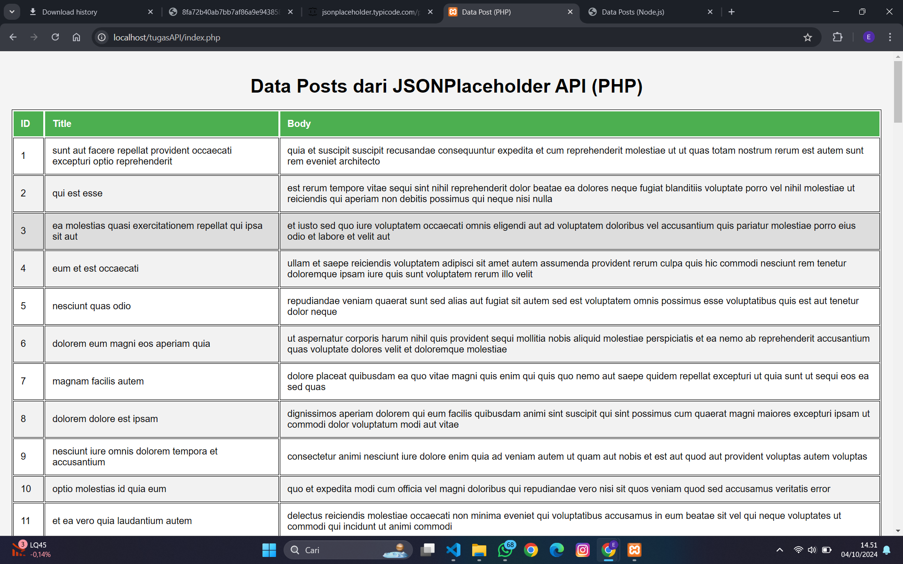
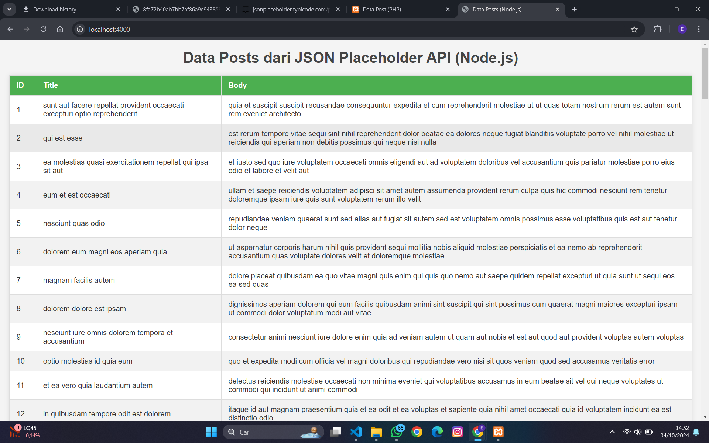
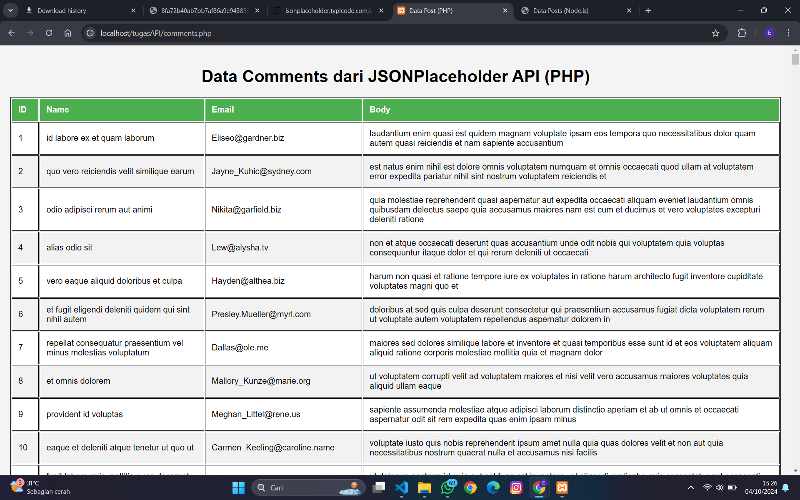
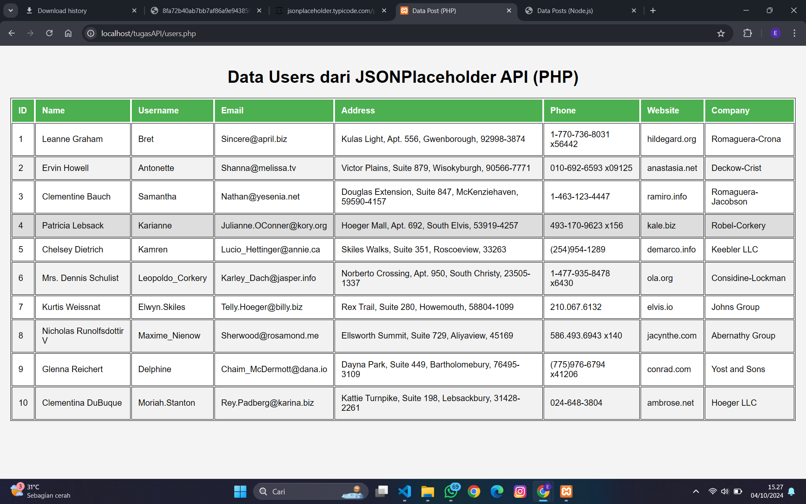
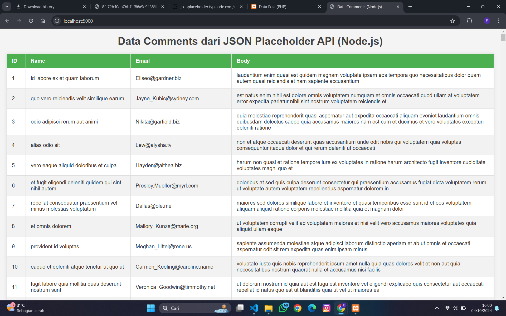
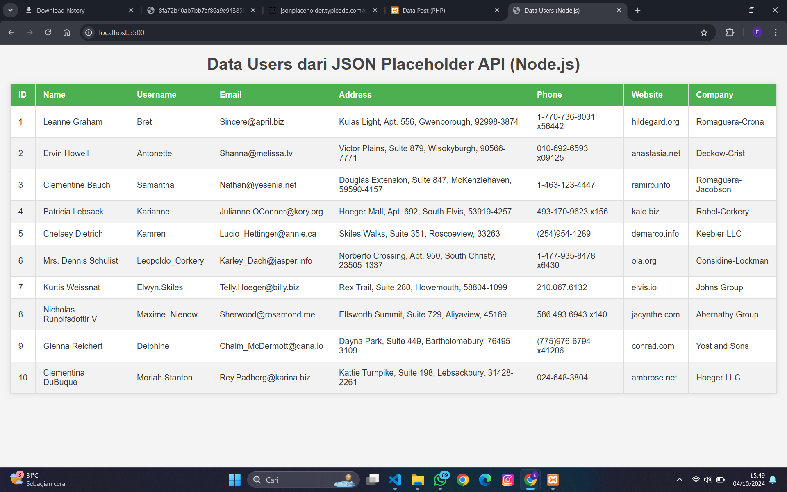
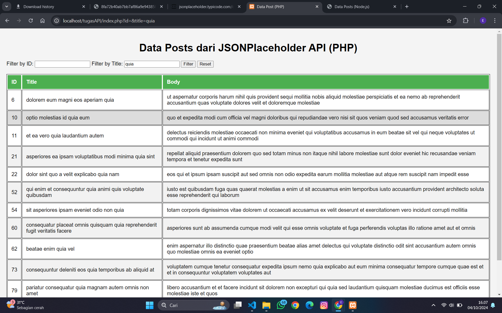
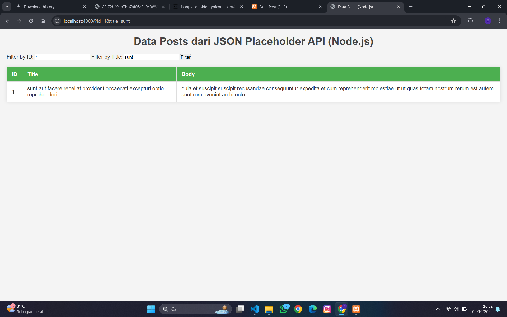
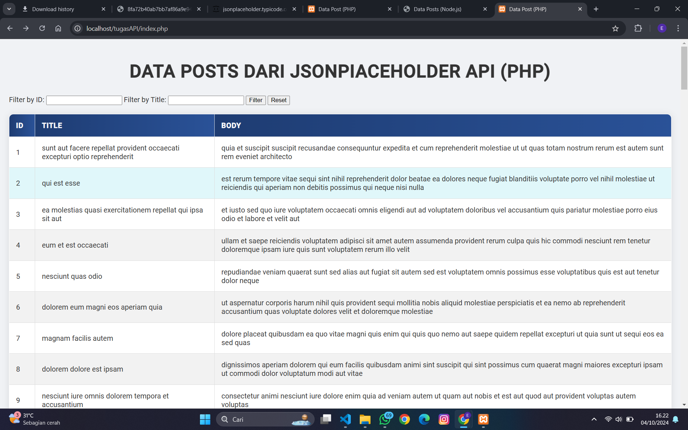
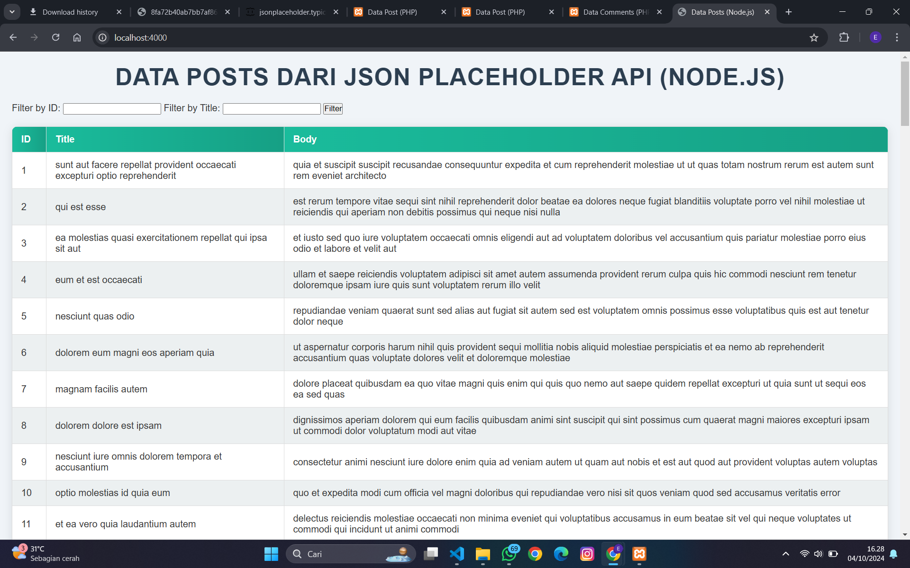

Nama    : Erlang Sinatrya Putra Yusya

NIM     : 362358302083

Kelas   : 2B TRPL
        
        
        Bagian 1 : Konsumsi API menggunakan PHP

Code : [posts](index.php)

hasil :

        Bagian 2 : Konsumsi API menggunakan Node.js

Code : [node.js](index.js)

hasil :

        Tugas Praktikum

1. Modifikasi php 

Data Commments : 

code : [comments](comments.php)

hasil : 

Data Users : 

code : [users](users.php)

hasil : 

    Modifikasi Node.js

Data Comments :

code : [comments.jd](comments.js)

hasil :

Data Users :

code : [users.js](users.js)

hasil :

    Tambahkan Fitur Filter 

PHP

code : [text](index.php)

Node js 

code : [text](index.js)

    Desain Lebih Menarik

PHP 

Node.js

